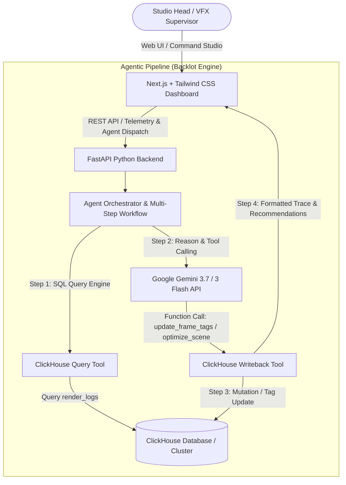

# Implementation Plan: Backlot - Autonomous Media Production & Render Farm Agentic AI

Backlot is an autonomous agentic platform built for the **Google Cloud Summer Blockbuster Hackathon ("Media & Entertainment Agentic AI Workflows")**. It combines **Gemini 3.7 / 3 Flash** and **ClickHouse** to automate media production workflows, analyze high-throughput render farm telemetry logs, pinpoint GPU/memory latency bottlenecks, and execute autonomous database writebacks.

---

## User Review Required

> [!IMPORTANT]
> The project architecture includes both full live connectivity (via `google-genai` and `clickhouse-connect`) and a high-fidelity local simulation fallback engine. This ensures the app can run out-of-the-box in development/judging environments with or without live API keys, while fully utilizing live Gemini & ClickHouse instances when configured in `.env`.

---

## Architecture Overview

---

## Proposed Changes

### 1. Root Configuration & Project Scaffold
- [NEW] [LICENSE](file:///c:/Users/ADMIN/Desktop/Backlot%20OS/LICENSE): MIT License for open source hackathon submission.
- [NEW] [README.md](file:///c:/Users/ADMIN/Desktop/Backlot%20OS/README.md): Comprehensive documentation with architectural diagrams, agentic workflow flowcharts, step-by-step installation, environment configuration, and demo instructions.
- [NEW] [.env.example](file:///c:/Users/ADMIN/Desktop/Backlot%20OS/.env.example): Root environment variable template.
- [NEW] [.gitignore](file:///c:/Users/ADMIN/Desktop/Backlot%20OS/.gitignore): Standard gitignore for Python, Node, Next.js, and env files.

---

### 2. Backend Service (`/backend`)
Python FastAPI application orchestrating ClickHouse queries and Gemini agentic reasoning.

- [NEW] [`backend/requirements.txt`](file:///c:/Users/ADMIN/Desktop/Backlot%20OS/backend/requirements.txt):
  - `fastapi`, `uvicorn`, `google-genai`, `google-cloud-aiplatform`, `clickhouse-connect`, `pydantic`, `python-dotenv`.
- [NEW] [`backend/config.py`](file:///c:/Users/ADMIN/Desktop/Backlot%20OS/backend/config.py):
  - Environment variable loader and settings validator.
- [NEW] [`backend/database.py`](file:///c:/Users/ADMIN/Desktop/Backlot%20OS/backend/database.py):
  - ClickHouse client setup using `clickhouse_connect`.
  - Schema definitions for `render_logs` (`frame_id`, `scene_name`, `episode`, `sequence_id`, `render_time_ms`, `cost_usd`, `status`, `tags`, `gpu_util_pct`, `memory_gb`, `error_type`, `created_at`).
  - Resilient connection manager with in-memory replica fallback when remote host is unavailable.
- [NEW] [`backend/seed.py`](file:///c:/Users/ADMIN/Desktop/Backlot%20OS/backend/seed.py):
  - Generates realistic VFX studio render logs across multiple scenes/episodes (e.g. `Ep3_Sc04_DragonFlight`, `Ep3_Sc12_DeepSpaceBattle`, `Ep4_Sc01_CyberpunkCity`) with varying latency, GPU saturation, and failure anomalies.
- [NEW] [`backend/agent.py`](file:///c:/Users/ADMIN/Desktop/Backlot%20OS/backend/agent.py):
  - Autonomous Multi-Step Agent implementation with `google-genai` SDK.
  - Native tool declarations:
    1. `execute_clickhouse_query(sql_query: str)`
    2. `tag_render_frames(frame_ids: list[str], tag: str, notes: str)`
    3. `recommend_resource_allocation(scene_name: str, recommended_gpu: str, estimated_savings_usd: float)`
  - Step-by-step trace capture (`Step 1: Query`, `Step 2: Reason`, `Step 3: Writeback`, `Step 4: Summary`).
- [NEW] [`backend/main.py`](file:///c:/Users/ADMIN/Desktop/Backlot%20OS/backend/main.py):
  - FastAPI application entry point with CORS.
  - Endpoints:
    - `GET /api/health`: Health status & ClickHouse / Gemini connection diagnostics.
    - `GET /api/telemetry/stats`: Live aggregated metrics from ClickHouse (total frames, avg latency, total cost, failure rate).
    - `GET /api/telemetry/scenes`: Scene-by-scene cost, frame count, latency percentiles.
    - `GET /api/telemetry/logs`: Paginated render log records with filtering by scene and tag.
    - `POST /api/telemetry/seed`: Trigger database re-seed / sample log insertion.
    - `POST /api/agent/run`: Run autonomous multi-step agent workflow with user prompt.

---

### 3. Frontend Application (`/frontend`)
High-performance Next.js 15+ App Router application with Tailwind CSS, Lucide icons, and modern studio UI.

- [NEW] [`frontend/package.json`](file:///c:/Users/ADMIN/Desktop/Backlot%20OS/frontend/package.json) & Tailwind configuration.
- [NEW] [`frontend/src/app/layout.tsx`](file:///c:/Users/ADMIN/Desktop/Backlot%20OS/frontend/src/app/layout.tsx): App root layout with dark studio theme and font styling.
- [NEW] [`frontend/src/app/page.tsx`](file:///c:/Users/ADMIN/Desktop/Backlot%20OS/frontend/src/app/page.tsx): Main dashboard integrating the 3 core panels:
  - **Header**: Studio branding (*CineFlow Agent | Powered by Gemini & ClickHouse*), live connection badges, reseed action.
  - **Panel A (Telemetry Grid)**: Live ClickHouse metrics, latency distribution, scene cost bars, render status rings, and interactive log table with live tags.
  - **Panel B (Agent Command Studio)**: Prompt input, 1-click preset agentic workflows (e.g. *Analyze Ep 3 latency & auto-tag*, *Diagnose GPU VRAM thrashing*, *Compute cloud render cost optimizations*), active execution indicator.
  - **Panel C (Execution Trace / Artifacts)**: Real-time visual timeline showing:
    - Step 1: SQL Query executed on ClickHouse (with syntax highlighter & row counter).
    - Step 2: Gemini Tool Calling & Bottleneck Reasoning (with anomaly scores & GPU stats).
    - Step 3: Database write-back confirmation (with mutation status & updated frame count).
    - Step 4: Executive Insights & Recommended Action Plan.
- [NEW] [`frontend/src/components/...`](file:///c:/Users/ADMIN/Desktop/Backlot%20OS/frontend/src/components/):
  - `Header.tsx`, `TelemetryGrid.tsx`, `AgentCommandStudio.tsx`, `ExecutionTrace.tsx`, `RenderLogsTable.tsx`, `MetricsCard.tsx`.

---

## Verification Plan

### Automated & Unit Tests
1. Backend Seed & Database Initialization:
   - Run `python backend/seed.py` and verify table schema creation and sample records.
2. Backend API Verification:
   - Verify `GET /api/telemetry/stats` returns valid aggregated ClickHouse data.
   - Verify `POST /api/agent/run` processes agent requests and returns structured multi-step traces.
3. Frontend Build Verification:
   - Run `npm run build` in `/frontend` to verify TypeScript types and CSS compilation.

### Manual End-to-End Verification
- Launch backend (`uvicorn backend.main:app`) and frontend (`npm run dev`).
- Test 1-click preset prompt: *"Analyze scene render logs for Ep 3 and auto-tag high-latency frames"*.
- Confirm live trace shows:
  1. ClickHouse query execution
  2. Gemini analysis & tool invocation
  3. Database mutation / tag writeback
  4. Telemetry grid updating with new tags and stats in real-time.
