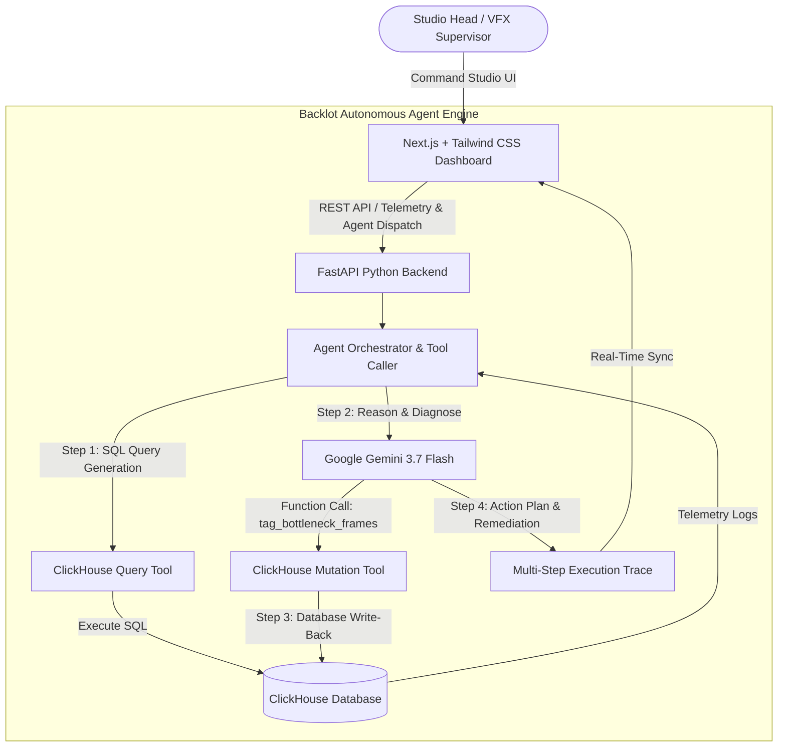

# Backlot — Autonomous Media Production & Render Farm Agentic AI

> **Submission for the Google Cloud Summer Blockbuster Hackathon ("Media & Entertainment Agentic AI Workflows")**

**Backlot** is an autonomous agentic application powered by **Google Gemini** and **Google Cloud** that interacts with **ClickHouse** to automate media production workflows, detect render farm latency bottlenecks, optimize cloud GPU compute costs, and enrich scene metadata with bidirectional database writebacks.

---

## 🎬 Architecture Overview



---

## 🚀 Key Features

- **Multi-Step Agentic Workflow**:
  1. **QUERY**: Executes high-throughput SQL on ClickHouse `render_logs` table (containing `frame_id`, `scene_name`, `render_time_ms`, `cost_usd`, `status`, `gpu_util_pct`, `vram_allocated_gb`).
  2. **REASON**: Passes telemetry records to **Gemini 3.7 Flash** using function calling and tool definitions to analyze high-latency anomalies (e.g. VRAM paging, volumetric pyro saturation, ray bounce overhead).
  3. **WRITE-BACK**: Writes updated tags, anomaly flags, and scene metadata directly back into ClickHouse via SQL mutations (`ALTER TABLE ... UPDATE`).
  4. **RESPONSE**: Generates visual multi-step execution traces, identified bottleneck frames, and executive cost reduction recommendations.

- **Panel A: Live ClickHouse Telemetry Grid**:
  - Aggregated KPIs: Total Frames Rendered, Average Render Time, Cloud Compute Burn, Anomaly Rate.
  - Scene-by-Scene Cost and Latency breakdowns.
  - Visual latency percentiles and GPU memory cluster health.

- **Panel B: Agent Command Studio**:
  - Interactive chat and command bar where studio heads can dispatch natural language directives.
  - 1-Click Studio Presets:
    - *Analyze scene render logs for Ep 3 and auto-tag high-latency frames*
    - *Detect GPU VRAM saturation & nebula raytracing bottlenecks in DeepSpaceBattle*
    - *Compute cost savings and node reallocation for ExplosionFX scene*
    - *Studio-wide render health and anomaly audit*

- **Panel C: Multi-Step Execution Trace & Artifacts**:
  - Step-by-step visual audit trail displaying:
    - Formatted ClickHouse SQL queries and query latency.
    - Gemini model thought process and root cause analysis.
    - Function call argument payload.
    - ClickHouse writeback mutation query confirmation.
    - Executive recommendations with estimated speedup multipliers and projected USD savings.

- **ClickHouse Live Table Explorer**:
  - Live data feed of `render_logs` with interactive search, scene filtering, status filtering, and live tag updates.

---

## 🛠️ Project Structure

```
Backlot OS/
├── backend/
│   ├── config.py             # Environment configuration & settings loader
│   ├── database.py           # ClickHouse client manager & in-memory simulation engine
│   ├── seed.py               # Mock VFX telemetry data generator
│   ├── agent.py              # Gemini 3.7 Agent orchestrator with tool definitions
│   ├── main.py               # FastAPI application with CORS & REST endpoints
│   ├── requirements.txt      # Python dependencies
│   └── .env.example          # Backend environment variables
├── frontend/
│   ├── src/
│   │   ├── app/              # Next.js App Router (layout.tsx, page.tsx, globals.css)
│   │   ├── components/       # UI Components (Header, TelemetryGrid, AgentCommandStudio, ExecutionTrace, RenderLogsTable)
│   │   ├── lib/              # API REST client
│   │   └── types/            # TypeScript interfaces
│   ├── tailwind.config.js    # Cinematic dark studio theme
│   ├── package.json          # Node dependencies
│   └── tsconfig.json         # TypeScript configuration
├── .env.example              # Root environment template
├── .gitignore                # Git ignore rules
├── LICENSE                   # MIT License (required for hackathon)
└── README.md                 # Complete documentation & architecture guide
```

---

## ⚡ Quick Start

### 1. Prerequisites
- **Python 3.11+**
- **Node.js 18+** & **npm**

### 2. Configure Environment Variables
Copy `.env.example` to `.env`:
```bash
cp .env.example .env
```

Edit `.env` with your Google Cloud / Gemini API key and ClickHouse credentials:
```env
GEMINI_API_KEY=your_gemini_api_key
CLICKHOUSE_HOST=your_clickhouse_host
CLICKHOUSE_PORT=8443
CLICKHOUSE_USER=default
CLICKHOUSE_PASSWORD=your_password
CLICKHOUSE_DATABASE=default
CLICKHOUSE_SECURE=True
```

> **Note**: Backlot is built with a resilient dual-mode engine. If live ClickHouse or Gemini credentials are not provided during local judging or testing, the application automatically uses its high-fidelity deterministic engine so you can test all features out-of-the-box!

---

### 3. Start the Backend (FastAPI)

```bash
# From the repository root
pip install -r backend/requirements.txt

# Run the FastAPI server
uvicorn backend.main:app --reload --port 8000
```
- API Swagger Docs available at: `http://localhost:8000/docs`
- Health check available at: `http://localhost:8000/api/health`

---

### 4. Start the Frontend (Next.js)

```bash
# Navigate to frontend
cd frontend

# Install dependencies
npm install

# Start Next.js development server
npm run dev
```
- Dashboard available at: `http://localhost:3000`

---

## 📊 Database Schema (`render_logs`)

| Column Name | Type | Description |
| :--- | :--- | :--- |
| `frame_id` | `String` | Unique frame identifier (e.g. `FR-1042`) |
| `scene_name` | `String` | VFX Scene name (e.g. `Ep3_Sc04_DragonFlight`) |
| `episode` | `String` | Episode identifier (e.g. `Ep 3`) |
| `sequence_id` | `String` | Sequence reference (e.g. `SEQ-304`) |
| `render_time_ms` | `UInt32` | Compute duration in milliseconds |
| `cost_usd` | `Float32` | Compute cost in USD |
| `status` | `String` | `COMPLETED`, `HIGH_LATENCY`, `FAILED`, `OPTIMIZED` |
| `tags` | `Array(String)` | Frame tags enriched by agent (e.g. `['LATENCY_ANOMALY', 'AI_LATENCY_AUTO_TAG']`) |
| `gpu_util_pct` | `Float32` | Peak GPU utilization percentage |
| `memory_gb` | `Float32` | System RAM consumption |
| `vram_allocated_gb` | `Float32` | GPU VRAM memory footprint |
| `error_type` | `String` | Root cause category (e.g. `VOLUMETRIC_PYRO_SPIKE`) |
| `worker_node` | `String` | Render node (e.g. `node-gpu-a100-01`) |
| `created_at` | `DateTime` | Timestamp of frame completion |

---

## 📡 REST API Endpoints

- `GET /api/health` — Service health & ClickHouse / Gemini connection status
- `GET /api/telemetry/stats` — Overall KPI metrics (frames, avg latency, cost, anomaly rate)
- `GET /api/telemetry/scenes` — Scene-by-scene aggregation from ClickHouse
- `GET /api/telemetry/logs` — Filterable and paginated render logs
- `POST /api/telemetry/seed` — Reseed ClickHouse with fresh sample VFX telemetry
- `POST /api/agent/run` — Execute multi-step autonomous agent workflow with prompt

---

## 🏆 Hackathon Alignment

- **Google Cloud & Gemini**: Employs `google-genai` SDK and Gemini 3.7 Flash for multi-turn reasoning and autonomous tool dispatch.
- **ClickHouse Cloud / Engine**: Leverages high-performance columnar analytics for real-time log ingestion and SQL mutations.
- **Production Media & Entertainment**: Solves critical VFX render farm bottleneck detection, cloud GPU burn reduction, and automated scene metadata tagging.

---

## 📄 License
This project is licensed under the MIT License — see the [LICENSE](LICENSE) file for details.
